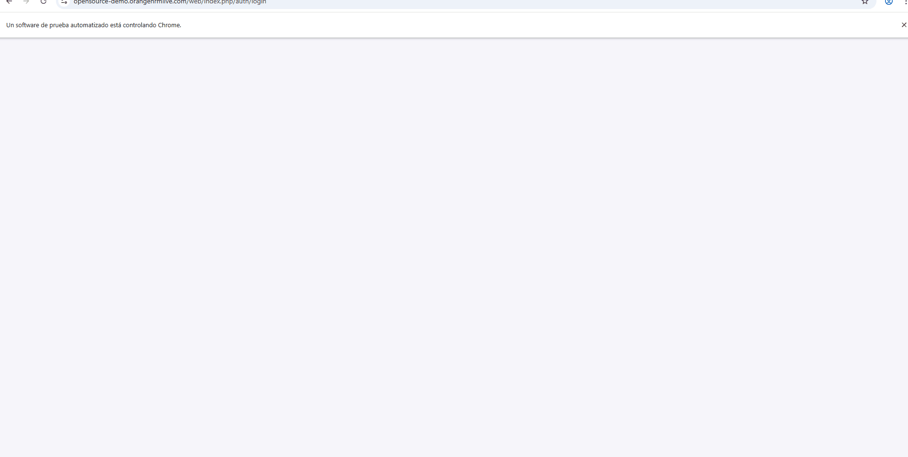
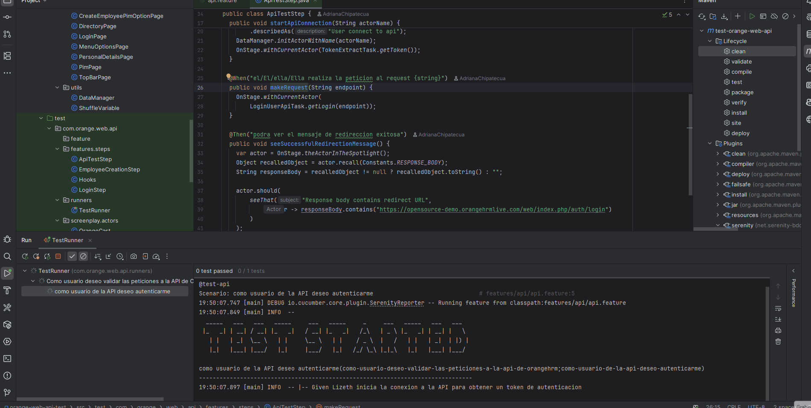
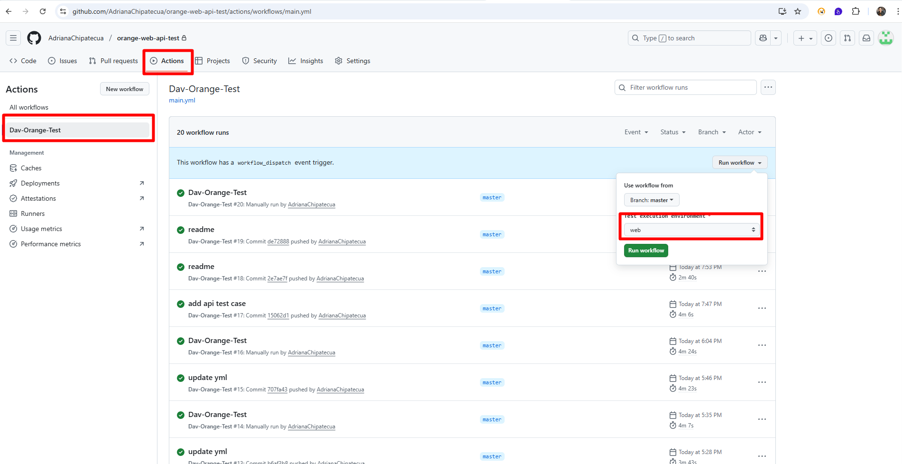

# test-orange-web-api
This repository contains automated tests for validating the user login functionality of the OrangeHRM platform, covering both UI (web) and API layers.

### It includes:

- Web UI tests executed through Serenity BDD using the Screenplay pattern.

- API validation tests to verify token generation, cookie management, and authentication endpoints.

- Continuous Integration workflows (via GitHub Actions) that build, execute, and publish Serenity test reports automatically.
## Setup

### Requirements

1 Maven https://maven.apache.org/install.html

2 IntelliJ https://www.jetbrains.com/idea/download/

3 JDK 21

## Execute testing

### Create Employee

### loginEmployee API

## Local

To execute the tests, please run the next command :

`mvn clean verify -Denvironment=web`

## Running a workflow in GitHub Actions

1 On GitHub, navigate to the main page of the repository.

2 Under orange-web-api-test repository name, click  Actions. 

3 In the left sidebar, click “Dav-Orange-Test” to start the workflow.

4 Click the 'Run workflow' button above the workflow runs list, and then choose whether you want to run Web or API tests.

More about Manually running a workflow : 
https://docs.github.com/en/actions/managing-workflow-runs-and-deployments/managing-workflow-runs/manually-running-a-workflow

